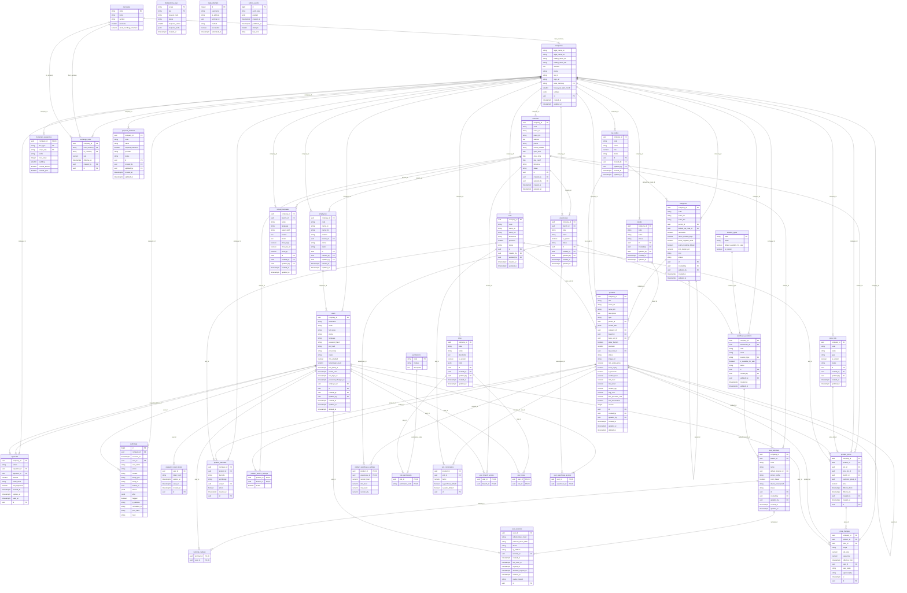

# Entity relationship diagram

Generated by `scripts/erd.py` from the SQLAlchemy models (39 tables). Do not edit by hand.
`created_by` / `updated_by` links to `users` are omitted for readability.

```mermaid
erDiagram
    approvals {
        uuid company_id FK
        string action
        uuid requester_id FK
        uuid approver_id FK
        numeric amount
        string token_hash
        boolean self_approved
        timestamptz created_at
        timestamptz expires_at
        timestamptz used_at
        uuid id PK
    }
    audit_logs {
        bigint id PK
        uuid company_id FK
        timestamptz occurred_at
        uuid user_id FK
        string user_name
        string action
        string module
        string entity_type
        string entity_id
        uuid branch_id
        jsonb before
        jsonb after
        boolean flagged
        string ip_address
        string correlation_id
        string prev_hash
        string hash
    }
    branches {
        uuid company_id FK
        string code
        string name_en
        string name_km
        text address
        string phone
        string receipt_header
        time open_time
        time close_time
        time day_cutoff
        string timezone
        string status
        uuid id PK
        uuid created_by FK
        uuid updated_by FK
        timestamptz created_at
        timestamptz updated_at
    }
    brands {
        uuid company_id FK
        string code
        string name
        string status
        uuid id PK
        uuid created_by FK
        uuid updated_by FK
        timestamptz created_at
        timestamptz updated_at
    }
    categories {
        uuid company_id FK
        string code
        string name_en
        string name_km
        uuid parent_id FK
        uuid default_tax_code_id FK
        boolean returnable
        smallint return_window_days
        boolean allow_negative_stock
        boolean expiry_tracking_default
        numeric min_margin_pct
        string icon
        string status
        uuid id PK
        uuid created_by FK
        uuid updated_by FK
        timestamptz created_at
        timestamptz updated_at
    }
    companies {
        string legal_name_en
        string legal_name_km
        string trading_name_en
        string trading_name_km
        text address
        string phone
        string tax_id
        string logo_url
        string base_currency FK
        smallint fiscal_year_start_month
        jsonb settings
        uuid id PK
        timestamptz created_at
        timestamptz updated_at
    }
    currencies {
        string code PK
        string name
        string symbol
        smallint decimals
        numeric cash_rounding_increment
    }
    document_sequences {
        uuid company_id PK,FK
        string doc_type PK
        string scope_key PK
        string prefix
        integer next_value
        smallint padding
        boolean include_branch
        boolean include_year
    }
    employees {
        uuid company_id FK
        string code
        string name_en
        string name_km
        string position
        uuid branch_id FK
        string phone
        string status
        uuid id PK
        uuid created_by FK
        uuid updated_by FK
        timestamptz created_at
        timestamptz updated_at
    }
    exchange_rates {
        uuid company_id FK
        string from_currency FK
        string to_currency FK
        numeric rate
        timestamptz effective_at
        uuid created_by FK
        uuid id PK
    }
    idempotency_keys {
        string scope PK
        string key PK
        string request_hash
        string status
        smallint response_status
        jsonb response_body
        timestamptz created_at
    }
    location_types {
        string code PK
        string name
        boolean default_available_for_sale
        boolean is_system
    }
    login_attempts {
        integer id PK
        string username
        string ip_address
        uuid terminal_id
        string method
        boolean succeeded
        timestamptz attempted_at
    }
    outbox_events {
        bigint id PK
        string event_type
        jsonb payload
        timestamptz created_at
        timestamptz published_at
        smallint attempts
        string last_error
    }
    password_reset_tokens {
        uuid user_id FK
        string token_hash
        timestamptz expires_at
        timestamptz used_at
        timestamptz created_at
        uuid id PK
    }
    payment_methods {
        uuid company_id FK
        string code
        string name
        boolean requires_reference
        string provider
        string status
        uuid id PK
        uuid created_by FK
        uuid updated_by FK
        timestamptz created_at
        timestamptz updated_at
    }
    permissions {
        string code PK
        string module
        text description
    }
    pos_terminals {
        uuid company_id FK
        uuid branch_id FK
        string code
        string name
        uuid default_location_id FK
        string printer_profile
        boolean cash_drawer
        string device_token_hash
        string status
        uuid id PK
        uuid created_by FK
        uuid updated_by FK
        timestamptz created_at
        timestamptz updated_at
    }
    price_changes {
        uuid company_id FK
        uuid product_id FK
        uuid price_id FK
        string scope
        numeric old_price
        numeric new_price
        timestamptz effective_from
        uuid user_id FK
        string user_name
        string approved_by
        timestamptz at
        uuid id PK
    }
    price_lists {
        uuid company_id FK
        string code
        string name
        string type
        boolean is_system
        string status
        uuid id PK
        uuid created_by FK
        uuid updated_by FK
        timestamptz created_at
        timestamptz updated_at
    }
    product_barcodes {
        uuid company_id FK
        uuid product_id FK
        string barcode
        string symbology
        uuid unit_id FK
        boolean active
        timestamptz created_at
        uuid id PK
    }
    product_branch_settings {
        uuid product_id PK,FK
        uuid branch_id PK,FK
        boolean active
    }
    product_prices {
        uuid company_id FK
        uuid product_id FK
        uuid unit_id FK
        uuid price_list_id FK
        uuid branch_id FK
        uuid customer_group_id
        numeric price
        timestamptz effective_from
        timestamptz effective_to
        uuid created_by FK
        timestamptz created_at
        uuid id PK
    }
    product_warehouse_settings {
        uuid product_id PK,FK
        uuid warehouse_id PK,FK
        numeric reorder_level
        numeric min_level
        numeric max_level
        numeric reorder_qty
    }
    products {
        uuid company_id FK
        string sku
        string name_en
        string name_km
        text description
        string type
        uuid parent_id FK
        jsonb variant_attrs
        uuid category_id FK
        uuid brand_id FK
        uuid base_unit_id FK
        boolean allow_fraction
        smallint precision
        uuid tax_code_id FK
        string status
        string image_url
        numeric min_selling_price
        boolean track_expiry
        boolean is_favourite
        numeric reorder_level
        numeric min_level
        numeric max_level
        numeric reorder_qty
        numeric avg_cost
        numeric last_purchase_cost
        boolean has_movements
        integer version
        uuid id PK
        uuid created_by FK
        uuid updated_by FK
        timestamptz created_at
        timestamptz updated_at
        timestamptz deleted_at
    }
    receipt_templates {
        uuid company_id FK
        uuid branch_id FK
        string name
        string language
        string paper_width
        text header
        text footer
        boolean show_logo
        boolean show_tax_id
        boolean show_qr
        uuid id PK
        uuid created_by FK
        uuid updated_by FK
        timestamptz created_at
        timestamptz updated_at
    }
    role_permissions {
        uuid role_id PK,FK
        string permission_code PK,FK
    }
    roles {
        uuid company_id FK
        string code
        string name
        text description
        boolean is_system
        jsonb limits
        uuid id PK
        uuid created_by FK
        uuid updated_by FK
        timestamptz created_at
        timestamptz updated_at
    }
    tax_codes {
        uuid company_id FK
        string code
        string name
        numeric rate
        string status
        uuid id PK
        uuid created_by FK
        uuid updated_by FK
        timestamptz created_at
        timestamptz updated_at
    }
    terminal_cashiers {
        uuid terminal_id PK,FK
        uuid user_id PK,FK
    }
    unit_conversions {
        uuid product_id FK
        uuid unit_id FK
        numeric factor
        boolean is_purchase_default
        boolean is_sales_default
        uuid id PK
    }
    units {
        uuid company_id FK
        string code
        string name_en
        string name_km
        string dimension
        smallint precision
        string status
        uuid id PK
        uuid created_by FK
        uuid updated_by FK
        timestamptz created_at
        timestamptz updated_at
    }
    user_branch_access {
        uuid user_id PK,FK
        uuid branch_id PK,FK
    }
    user_roles {
        uuid user_id PK,FK
        uuid role_id PK,FK
    }
    user_sessions {
        uuid user_id FK
        string refresh_token_hash
        string previous_token_hash
        string device
        string ip_address
        uuid terminal_id FK
        timestamptz created_at
        timestamptz last_seen_at
        timestamptz expires_at
        timestamptz absolute_expires_at
        timestamptz revoked_at
        string revoke_reason
        uuid id PK
    }
    user_warehouse_access {
        uuid user_id PK,FK
        uuid warehouse_id PK,FK
    }
    users {
        uuid company_id FK
        string username
        string email
        string full_name
        string phone
        string language
        string password_hash
        string pin_hash
        string pin_lookup
        string status
        boolean mfa_enabled
        smallint failed_login_count
        timestamptz first_failed_at
        timestamptz locked_until
        timestamptz last_login_at
        timestamptz password_changed_at
        uuid employee_id FK
        uuid id PK
        uuid created_by FK
        uuid updated_by FK
        timestamptz created_at
        timestamptz updated_at
        timestamptz deleted_at
    }
    warehouse_locations {
        uuid company_id FK
        uuid warehouse_id FK
        string code
        string name
        string location_type FK
        boolean is_available_for_sale
        string status
        uuid id PK
        uuid created_by FK
        uuid updated_by FK
        timestamptz created_at
        timestamptz updated_at
    }
    warehouses {
        uuid company_id FK
        uuid branch_id FK
        string code
        string name
        boolean is_system
        string status
        uuid id PK
        uuid created_by FK
        uuid updated_by FK
        timestamptz created_at
        timestamptz updated_at
    }
    branches ||--o{ employees : "branch_id"
    branches ||--o{ product_prices : "branch_id"
    branches ||--o{ receipt_templates : "branch_id"
    branches ||--o{ warehouses : "branch_id"
    branches ||--|{ pos_terminals : "branch_id"
    branches ||--|{ product_branch_settings : "branch_id"
    branches ||--|{ user_branch_access : "branch_id"
    brands ||--o{ products : "brand_id"
    categories ||--o{ categories : "parent_id"
    categories ||--|{ products : "category_id"
    companies ||--o{ audit_logs : "company_id"
    companies ||--|{ approvals : "company_id"
    companies ||--|{ branches : "company_id"
    companies ||--|{ brands : "company_id"
    companies ||--|{ categories : "company_id"
    companies ||--|{ document_sequences : "company_id"
    companies ||--|{ employees : "company_id"
    companies ||--|{ exchange_rates : "company_id"
    companies ||--|{ payment_methods : "company_id"
    companies ||--|{ pos_terminals : "company_id"
    companies ||--|{ price_changes : "company_id"
    companies ||--|{ price_lists : "company_id"
    companies ||--|{ product_barcodes : "company_id"
    companies ||--|{ product_prices : "company_id"
    companies ||--|{ products : "company_id"
    companies ||--|{ receipt_templates : "company_id"
    companies ||--|{ roles : "company_id"
    companies ||--|{ tax_codes : "company_id"
    companies ||--|{ units : "company_id"
    companies ||--|{ users : "company_id"
    companies ||--|{ warehouse_locations : "company_id"
    companies ||--|{ warehouses : "company_id"
    currencies ||--|{ companies : "base_currency"
    currencies ||--|{ exchange_rates : "from_currency"
    currencies ||--|{ exchange_rates : "to_currency"
    employees ||--o{ users : "employee_id"
    location_types ||--|{ warehouse_locations : "location_type"
    permissions ||--|{ role_permissions : "permission_code"
    pos_terminals ||--o{ user_sessions : "terminal_id"
    pos_terminals ||--|{ terminal_cashiers : "terminal_id"
    price_lists ||--|{ product_prices : "price_list_id"
    product_prices ||--o{ price_changes : "price_id"
    products ||--o{ products : "parent_id"
    products ||--|{ price_changes : "product_id"
    products ||--|{ product_barcodes : "product_id"
    products ||--|{ product_branch_settings : "product_id"
    products ||--|{ product_prices : "product_id"
    products ||--|{ product_warehouse_settings : "product_id"
    products ||--|{ unit_conversions : "product_id"
    roles ||--|{ role_permissions : "role_id"
    roles ||--|{ user_roles : "role_id"
    tax_codes ||--o{ categories : "default_tax_code_id"
    tax_codes ||--o{ products : "tax_code_id"
    units ||--|{ product_barcodes : "unit_id"
    units ||--|{ product_prices : "unit_id"
    units ||--|{ products : "base_unit_id"
    units ||--|{ unit_conversions : "unit_id"
    users ||--o{ audit_logs : "user_id"
    users ||--o{ price_changes : "user_id"
    users ||--|{ approvals : "approver_id"
    users ||--|{ approvals : "requester_id"
    users ||--|{ password_reset_tokens : "user_id"
    users ||--|{ terminal_cashiers : "user_id"
    users ||--|{ user_branch_access : "user_id"
    users ||--|{ user_roles : "user_id"
    users ||--|{ user_sessions : "user_id"
    users ||--|{ user_warehouse_access : "user_id"
    warehouse_locations ||--|{ pos_terminals : "default_location_id"
    warehouses ||--|{ product_warehouse_settings : "warehouse_id"
    warehouses ||--|{ user_warehouse_access : "warehouse_id"
    warehouses ||--|{ warehouse_locations : "warehouse_id"
```
